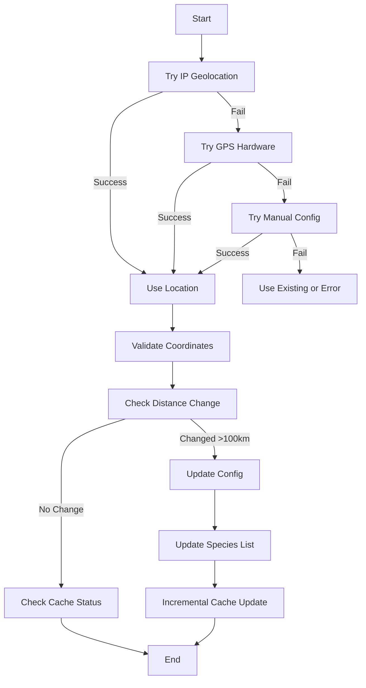

# BirdNET Display - Location Manager

Automated location detection and species cache management for BirdNET Display deployments.

## Overview

The Location Manager is a startup service that automatically:
1. **Detects device location** using multiple methods (IP geolocation, GPS hardware, manual config)
2. **Updates BirdNET-Go configuration** with accurate coordinates
3. **Fetches location-specific species lists** from BirdNET-Go API
4. **Manages image cache incrementally** (downloads only new species)

This eliminates manual configuration and ensures your bird detection system has accurate species data for your area.

---

## Features

### 🌍 Multi-Method Location Detection

The system tries multiple detection methods in order of preference:

1. **IP Geolocation** (Primary)
   - Accuracy: ~10-50km
   - No additional hardware required
   - Uses 3 free APIs with automatic fallback:
     - ipapi.co (1000 requests/day)
     - ip-api.com (45 requests/minute)
     - ipinfo.io (50k requests/month with key)

2. **GPS Hardware** (Secondary)
   - Accuracy: ~5-10m
   - Requires GPS module + gpsd service
   - Optional for high-precision deployments

3. **Manual Configuration** (Tertiary)
   - User-specified coordinates via JSON file
   - Fallback when automatic detection unavailable

### 🔄 Intelligent Cache Management

- **Incremental Updates**: Only downloads images for new species
- **Status Checking**: Reports cache health without downloading
- **Exit Codes**: Integration-friendly for systemd services
  - `0` = Success
  - `1` = Error
  - `2` = No changes needed

### ⚙️ Smart Update Logic

- **Distance Threshold**: Only updates if location changed by >100km
- **Automatic Backup**: Creates timestamped backups before config changes
- **Service Dependencies**: Waits for BirdNET-Go to be available
- **Graceful Degradation**: Continues with existing data if updates fail

---

## Installation

### Automatic (via install.sh)

The location manager is automatically installed when you run the BirdNET Display installer with kiosk mode:

```bash
./install.sh
# When prompted: "Are you setting this up on a Raspberry Pi for a kiosk display?"
# Answer: y
```

The installer will:
- Copy all location manager files
- Install Python dependencies
- Create and enable systemd service
- Configure automatic startup on boot

### Manual Installation

If you need to install the location manager on an existing deployment:

```bash
# 1. Copy files to installation directory
cd /home/jeremy/birdnet_display
cp location_manager.py .
cp -r utils/ .

# 2. Install dependencies (PyYAML)
source venv/bin/activate
pip install PyYAML requests

# 3. Install systemd service
sudo cp birdnet-location-manager.service /etc/systemd/system/
sudo systemctl daemon-reload
sudo systemctl enable birdnet-location-manager.service

# 4. Test the service
sudo systemctl start birdnet-location-manager.service
sudo systemctl status birdnet-location-manager.service
```

---

## Configuration

### Location Detection Priority

The location manager tries detection methods in this order:

#### 1. IP Geolocation (Automatic)

No configuration needed. Works out of the box with any internet connection.

**Pros:**
- Zero configuration
- Works everywhere
- Sufficient accuracy for bird species range filtering (~10-50km)

**Cons:**
- Less accurate than GPS
- Requires internet access
- May not work behind certain VPNs

#### 2. GPS Hardware (Optional)

For high-precision deployments with GPS modules:

```bash
# Install GPS support
sudo apt-get install gpsd gpsd-clients python3-gps

# Configure gpsd (example for USB GPS)
sudo nano /etc/default/gpsd
# Set: DEVICES="/dev/ttyUSB0"
# Set: GPSD_OPTIONS="-n"

# Enable service
sudo systemctl enable gpsd
sudo systemctl start gpsd

# Test GPS
cgps -s
```

The location manager will automatically use GPS if available and operational.

#### 3. Manual Configuration (Fallback)

Create a manual location config file:

```bash
# Generate template
cd /home/jeremy/birdnet_display
python3 -c "from utils.geolocation import create_manual_config_template; create_manual_config_template()"

# Edit coordinates
nano location_config.json
```

Example `location_config.json`:
```json
{
  "latitude": 37.7749,
  "longitude": -122.4194,
  "source": "manual",
  "city": "San Francisco",
  "region": "California",
  "country": "US"
}
```

The file can be placed in:
- `/home/jeremy/birdnet_display/location_config.json`
- `/etc/birdnet/location_config.json`
- `~/.config/birdnet/location_config.json`

### BirdNET-Go Configuration Path

Default: `/root/birdnet-go-app/config/config.yaml`

To change, edit `location_manager.py`:
```python
BIRDNET_CONFIG_PATH = "/path/to/your/config.yaml"
```

### Distance Threshold

Default: Location updates if changed by >100km

To change, edit `location_manager.py`:
```python
LOCATION_CHANGE_THRESHOLD_KM = 50  # Update if moved >50km
```

---

## Usage

### Automatic (Startup Service)

The location manager runs automatically on boot after BirdNET-Go starts:

```bash
# Check service status
sudo systemctl status birdnet-location-manager.service

# View logs
journalctl -u birdnet-location-manager.service -f

# Restart manually
sudo systemctl restart birdnet-location-manager.service
```

### Manual Execution

You can run the location manager manually for testing:

```bash
cd /home/jeremy/birdnet_display
source venv/bin/activate

# Run location manager
python3 location_manager.py

# Check exit code
echo $?
# 0 = success, 1 = error, 2 = no changes needed
```

### Cache Builder (Standalone)

The enhanced cache_builder.py can be used independently:

```bash
cd /home/jeremy/birdnet_display
source venv/bin/activate

# Check cache status (no downloads)
python3 cache_builder.py --check-only

# Download only new species
python3 cache_builder.py --incremental

# Update species list and download new species
python3 cache_builder.py --update-species --incremental

# Full rebuild (downloads all species)
python3 cache_builder.py

# Display help
python3 cache_builder.py --help
```

---

## How It Works

### Startup Sequence

```
Boot
 ├─ Network Available
 ├─ BirdNET-Go Service Starts
 ├─ Location Manager Service Starts
 │   ├─ Wait for BirdNET-Go (max 30s)
 │   ├─ Load current config
 │   ├─ Detect location (IP/GPS/Manual)
 │   ├─ Compare with existing location
 │   ├─ Update config if changed >100km
 │   ├─ Update species list from API
 │   ├─ Download new species images
 │   └─ Exit (success/error/no-changes)
 └─ BirdNET Display Service Starts
```

### Location Detection Flow



### Cache Update Logic

**First Run (No Location Set):**
1. Detect location → Update config
2. Fetch species list from API → Save to CSV
3. Build full image cache (~10-30 minutes)

**Subsequent Runs (Location Unchanged):**
1. Check if cache is up to date
2. If missing species: Download only new images (~1-5 minutes)
3. If complete: Exit with "no changes needed"

**Location Changed (Moved >100km):**
1. Update config with new coordinates
2. Fetch NEW species list (different birds in new area)
3. Download images for species not in cache (~5-15 minutes)
4. Keep existing cache (birds from old area remain cached)

---

## Monitoring and Logs

### Service Status

```bash
# Check if service is running
systemctl status birdnet-location-manager.service

# View recent service execution
journalctl -u birdnet-location-manager.service -n 50

# Follow logs in real-time
journalctl -u birdnet-location-manager.service -f
```

### Location Manager Log File

```bash
# View location manager log
tail -f /home/jeremy/birdnet_display/location_manager.log

# Search for errors
grep ERROR /home/jeremy/birdnet_display/location_manager.log

# Check last location update
grep "Detected location" /home/jeremy/birdnet_display/location_manager.log | tail -1
```

### BirdNET-Go Configuration

```bash
# View current location in config
sudo cat /root/birdnet-go-app/config/config.yaml | grep -A 2 "latitude:"

# View configuration backups
sudo ls -lht /root/birdnet-go-app/config/*.backup* | head -5
```

---

## Troubleshooting

### Location Not Detected

**Symptoms:** Service reports "Could not detect location using any method"

**Solutions:**

1. **Check Internet Connectivity**
   ```bash
   ping -c 3 8.8.8.8
   curl -s https://ipapi.co/json/ | jq '.city, .region, .country'
   ```

2. **Test IP Geolocation APIs**
   ```bash
   cd /home/jeremy/birdnet_display
   source venv/bin/activate
   python3 -c "from utils.geolocation import LocationDetector; d = LocationDetector(); print(d.detect_location())"
   ```

3. **Create Manual Config**
   ```bash
   python3 -c "from utils.geolocation import create_manual_config_template; create_manual_config_template()"
   nano location_config.json
   # Add your coordinates
   ```

### BirdNET-Go Not Available

**Symptoms:** Service reports "BirdNET-Go is not available. Cannot proceed."

**Solutions:**

1. **Check BirdNET-Go Service**
   ```bash
   systemctl status birdnet-go.service
   docker ps | grep birdnet-go
   ```

2. **Test API Endpoint**
   ```bash
   curl http://localhost:8080/health
   ```

3. **Restart BirdNET-Go**
   ```bash
   sudo systemctl restart birdnet-go.service
   sleep 10
   sudo systemctl restart birdnet-location-manager.service
   ```

### Cache Update Failed

**Symptoms:** Exit code 1, cache builder errors in logs

**Solutions:**

1. **Check Disk Space**
   ```bash
   df -h /home/jeremy/birdnet_display
   ```

2. **Test Species List API**
   ```bash
   curl http://localhost:8080/api/v2/range/species/list | jq '.species | length'
   ```

3. **Manual Cache Rebuild**
   ```bash
   cd /home/jeremy/birdnet_display
   source venv/bin/activate
   python3 cache_builder.py --update-species --incremental
   ```

### Permission Errors

**Symptoms:** "Failed to load BirdNET-Go configuration" or "Permission denied"

**Solutions:**

1. **Check File Permissions**
   ```bash
   sudo ls -l /root/birdnet-go-app/config/config.yaml
   ```

2. **Add User to Required Groups**
   ```bash
   # If running as non-root, may need specific permissions
   sudo usermod -aG docker jeremy
   ```

3. **Update Service File**
   Edit `/etc/systemd/system/birdnet-location-manager.service`:
   ```ini
   ReadWritePaths=/home/jeremy/birdnet_display /root/birdnet-go-app/config
   ```

### Service Won't Start

**Symptoms:** `systemctl status` shows "failed" or "inactive (dead)"

**Solutions:**

1. **Check Service Dependencies**
   ```bash
   systemctl list-dependencies birdnet-location-manager.service
   ```

2. **View Service Errors**
   ```bash
   journalctl -u birdnet-location-manager.service -xe
   ```

3. **Test Script Directly**
   ```bash
   cd /home/jeremy/birdnet_display
   source venv/bin/activate
   python3 location_manager.py
   echo $?  # Should be 0, 1, or 2
   ```

---

## File Structure

```
/home/jeremy/birdnet_display/
├── location_manager.py              # Main startup script
├── cache_builder.py                 # Enhanced with incremental updates
├── utils/
│   ├── __init__.py                  # Package initialization
│   ├── geolocation.py               # Location detection module
│   └── config_manager.py            # YAML config management
├── location_manager.log             # Service execution log
├── location_config.json             # Manual location config (optional)
└── species_list.csv                 # Location-specific species list

/etc/systemd/system/
└── birdnet-location-manager.service # Systemd service file

/root/birdnet-go-app/config/
├── config.yaml                      # BirdNET-Go configuration
└── config.yaml.backup_*             # Timestamped backups
```

---

## Advanced Configuration

### Custom Location Detection Order

Edit `location_manager.py`:

```python
# Skip IP geolocation, use GPS only
location_detector = LocationDetector(enable_ip_geolocation=False)

# Skip GPS, use IP only
location_detector = LocationDetector(enable_gps=False)

# Manual config only
detected_location = location_detector._try_manual_config()
```

### Disable Automatic Updates

To disable location manager but keep cache builder functionality:

```bash
# Disable service
sudo systemctl disable birdnet-location-manager.service
sudo systemctl stop birdnet-location-manager.service

# Manual updates only
cd /home/jeremy/birdnet_display
source venv/bin/activate
python3 cache_builder.py --update-species --incremental
```

### Force Location Update

To force a location update even if within threshold:

```bash
cd /home/jeremy/birdnet_display
source venv/bin/activate

# Edit config manager threshold temporarily
python3 << EOF
from utils.config_manager import BirdNETConfigManager
from utils.geolocation import LocationDetector

config = BirdNETConfigManager('/root/birdnet-go-app/config/config.yaml')
config.load()

detector = LocationDetector()
location = detector.detect_location()

if location:
    config.set_location(location['latitude'], location['longitude'])
    config.save(create_backup=True)
    print(f"Location updated to: {location['latitude']}, {location['longitude']}")
EOF

# Then update cache
python3 cache_builder.py --update-species --incremental
```

---

## Performance

### Execution Times

| Operation | Time (Typical) | Notes |
|-----------|---------------|-------|
| IP Geolocation | 1-3 seconds | First try usually succeeds |
| GPS Detection | 5-30 seconds | Depends on fix availability |
| Config Update | <1 second | Includes backup creation |
| Species List Fetch | 2-5 seconds | From BirdNET-Go API |
| Cache Check | 1-2 seconds | Scans existing cache |
| Incremental Update | 1-10 minutes | Depends on new species count |
| Full Cache Rebuild | 10-30 minutes | Depends on total species count |

### Resource Usage

- **Memory:** ~50MB during execution
- **CPU:** Low (mostly I/O-bound for image downloads)
- **Network:** ~2-5MB per species (3 images @ 800x600)
- **Disk:** ~10-20MB per cached species

### Optimization Tips

1. **Use Incremental Updates:** Default behavior, much faster than full rebuilds
2. **Reduce Image Count:** Edit `cache_builder.py` → `IMAGES_PER_SPECIES = 2`
3. **Adjust Threshold:** Increase `LOCATION_CHANGE_THRESHOLD_KM` to reduce updates
4. **Schedule Off-Peak:** Configure service to run at low-traffic times

---

## Security Considerations

### Service Hardening

The systemd service includes security features:

```ini
PrivateTmp=yes              # Isolated /tmp directory
NoNewPrivileges=yes         # Cannot gain privileges
ProtectSystem=strict        # Read-only file system
ProtectHome=yes             # Home directories protected
ReadWritePaths=...          # Only specific paths writable
```

### Network Security

- IP geolocation APIs use HTTPS
- No API keys stored in config (uses free tiers)
- No personal data transmitted (only IP address)

### Configuration Backups

- Automatic backups before every config change
- Timestamped: `config.yaml.backup_YYYYMMDD_HHMMSS`
- Keeps last 10 backups (manual cleanup)

---

## Contributing

### Reporting Issues

Include in bug reports:
- Service status: `systemctl status birdnet-location-manager.service`
- Recent logs: `journalctl -u birdnet-location-manager.service -n 50`
- Location manager log: `cat /home/jeremy/birdnet_display/location_manager.log`
- System info: `uname -a`, `python3 --version`

### Feature Requests

Potential enhancements:
- Web UI for manual location override
- Multiple location profiles
- Notification system for location changes
- Integration with Home Assistant
- Support for additional geolocation APIs

---

## License

This location manager is part of the BirdNET Display project.

Original BirdNET Display: https://github.com/yourusername/birdnet-display
BirdNET-Go: https://github.com/tphakala/birdnet-go

---

## Support

- **Documentation:** This README
- **Project Issues:** https://github.com/festion/birdnet-display/issues
- **BirdNET-Go Docs:** https://github.com/tphakala/birdnet-go/wiki
- **Community:** BirdNET Discord, Reddit r/BirdNET

---

**Last Updated:** October 2025
**Version:** 1.0.0
